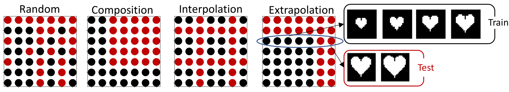

# InDomainGeneralizationBenchmark

We propose a simple generalization benchmark with various systematic
out-of-distribution test splits (composition, interpolation and extrapolation).
This procedure is visualized in the figure below.



Fig. 1: In the four scatter plots, we see various splits along the generative
factors of variations for the dSprites dataset. The axes correspond to
factors of variation in the data, i.e., *scale* as visualized for
extrapolation on the right.

### Datasets
We consider the dSprites, Shapes3D and MPI3D-Real dataset. The splits
corresponding to random, composition, interpolation and extrapolation can be
found at
[dSprites splits](https://zenodo.org/record/4835774),
[Shapes3D splits](https://zenodo.org/record/4898937),
[MPI3D splits](https://zenodo.org/record/4899346).

### Training
In this benchmark, we allow for a wide variety of modelling approaches and also
leveraging external data. Furthermore, a practitioner can sample from the
training data in whatever way is optimal for the learning algorithm.
For instance, this enables various supervision types from unsupervised,
weakly-supervised, supervised to transfer-learning.
However, the test set should remain untouched and can **only** be used for
evaluation.

### Evaluation
The random, composition and interpolation splits can be used for
hyperparameter tuning. The final evaluation and ranking can be done on the
extrapolation setting. Please submit a pull request with an updated leaderboard
to include novel results.

Evaluating your model on this benchmark can be done with as little as 3 lines
of code:

```python
import lablet_generalization_benchmark as lgb
import numpy as np


def model_fn(images: np.ndarray)->np.ndarray:
    # integrate your tensorflow, pytorch, jax model here
    predictions = model(images)
    return predictions

dataloader = lgb.load_dataset('shapes3d', 'extrapolation', mode='test')
# get dictionary of r2 and mse per factor
score = lgb.evaluate_model(model_fn, dataloader)

```
We use the R2 metric for evaluation and ranking models.

## MPI3D Leaderboard

|                Method               |  Reference  | R2 score Extrapolation|
|-------------------------------|------------------------------------------------------------------------|:-------:|
| RN50 (ImageNet-21k) | [Kolesnikov et al.](https://arxiv.org/pdf/1912.11370.pdf) |   54.1%|
| RN101 (ImageNet-21k) | [Kolesnikov et al.](https://arxiv.org/pdf/1912.11370.pdf) |   41.6%|
| PlaceHolder3 | placeholder |   --% |
| PlaceHolder4 | placeholder |   --% |


## Shapes3D Leaderboard

|                Method               |  Reference  | R2 score Extrapolation|
|-------------------------------|------------------------------------------------------------------------|:-------:|
| RN101 | [He et al.](https://arxiv.org/pdf/1512.03385.pdf) |   67.8%|
| RN50 | [He et al.](https://arxiv.org/pdf/1512.03385.pdf) |   62.8%|
| PlaceHolder3 | placeholder |   --% |
| PlaceHolder4 | placeholder |   --% |

## dSprites Leaderboard

|                Method               |  Reference  | R2 score Extrapolation|
|-------------------------------|------------------------------------------------------------------------|:-------:|
| PCL | [Hyvärinen et al.](https://www.cs.helsinki.fi/u/ahyvarin/papers/AISTATS17.pdf) |   66.7%|
| DenseNet121 | [Huang et al.](https://arxiv.org/pdf/1608.06993.pdf) |   64.4%|
| PlaceHolder3 | placeholder |   --% |
| PlaceHolder4 | placeholder |   --% |


## Citation

Please cite our [paper](https://arxiv.org/pdf/2107.08221.pdf) at 

@misc{schott2021visual,\
  title={Visual Representation Learning Does Not Generalize Strongly Within the Same Domain},\
      author={Lukas Schott, Julius von Kügelgen, Frederik Träuble, Peter Gehler, Chris Russell, Matthias Bethge, Bernhard Schölkopf, Francesco Locatello, Wieland Brendel},\
      year={2021},\
      eprint={2107.08221},\
      archivePrefix={arXiv},\
      primaryClass={cs.LG}\
}.
